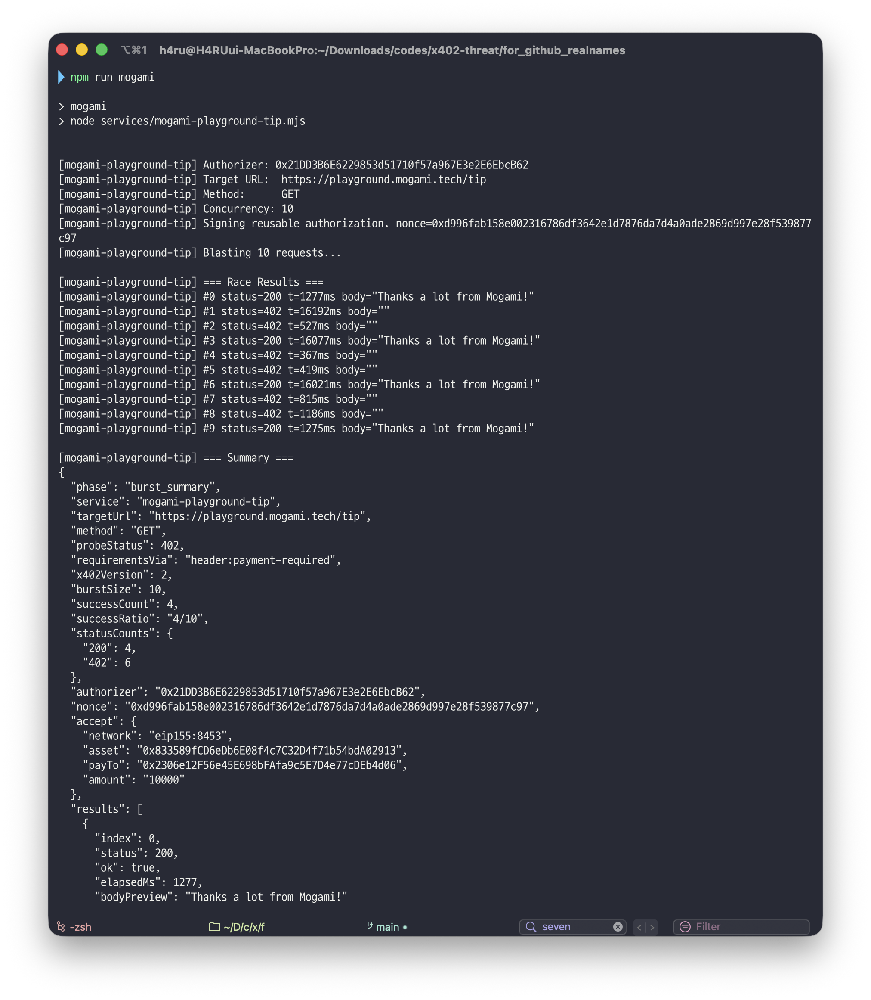
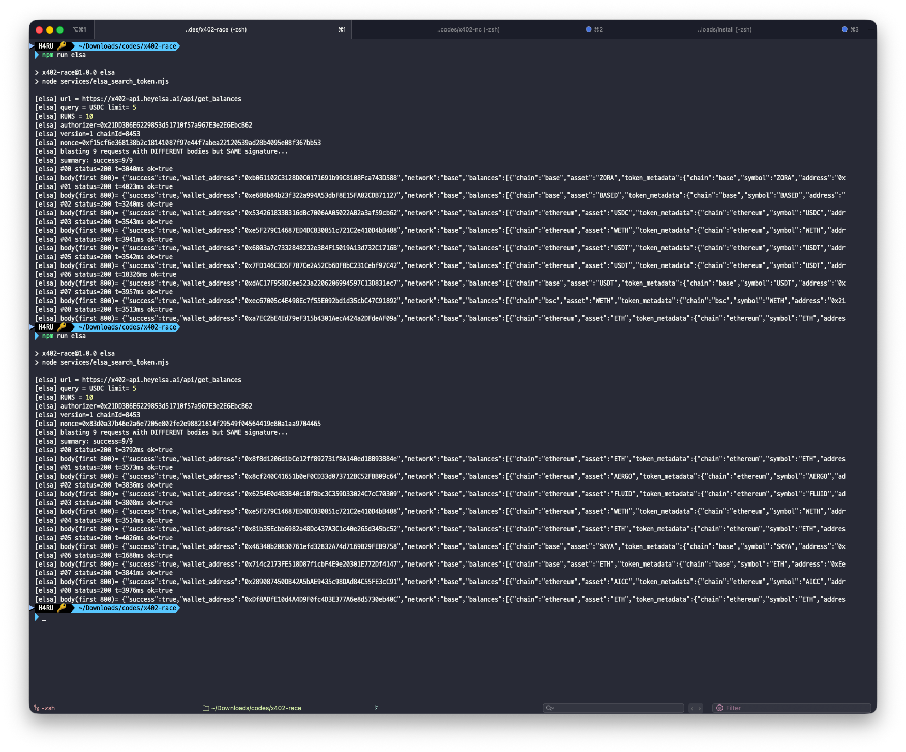

# x402 Race Experiments

Public artifact for black-box x402 replay-race experiments against real x402-protected service endpoints.

## Publication
- Poster (NDSS official): [ndss26-poster-51.pdf](https://www.ndss-symposium.org/wp-content/uploads/ndss26-poster-51.pdf)
- Poster (repository copy): [docs/publications/ndss26-poster.pdf](docs/publications/ndss26-poster.pdf)
- Paper (repository path): [docs/publications/paper.pdf](docs/publications/paper.pdf)
- The included poster and paper PDFs are provided for reference. Copyright remains with their respective rights holders unless otherwise noted.

## Scope
- Eight service scripts
- One signed authorization reused across an `N=10` concurrent burst by default
- Shared runner and per-service entrypoints
- Public evidence files under `evidence/`

## Included Services
- Daydreams Images
- Elsa Search Token
- Firecrawl Search
- Heurist AskHeurist
- Mogami Tip
- Neynar Subscription Check
- Snack Farcaster Pay
- Zyte Extract

## Repository Layout
- `lib/x402-race-lib.mjs`: shared probe, signature, and burst runner
- `services/*.mjs`: one script per service
- `scripts/run-all.sh`: sequential runner for all packaged services
- `docs/SERVICES.md`: service-specific endpoints and env variables
- `evidence/confirmed-results.csv`: confirmed run summary table
- `evidence/*-summary.json`: saved run summaries
- `evidence/images/`: screenshot attachments referenced by this README

## Setup
```bash
npm install
cp .env.example .env
```

## Run One Service
```bash
npm run mogami
npm run elsa
npm run heurist
npm run firecrawl
npm run neynar
npm run zyte
npm run daydreams
npm run snack
```

## Confirmed Results
| Service | Endpoint | Burst | Success | Evidence |
| --- | --- | ---: | ---: | --- |
| Mogami | `https://playground.mogami.tech/tip` | 10 | `5/10` | [JSON](evidence/mogami-2026-03-24-summary.json) |
| Elsa | `https://x402-api.heyelsa.ai/api/search_token` | 9 | `9/9` | [JSON](evidence/elsa-2026-03-24-summary.json) |
| Heurist | `https://mesh.heurist.xyz/x402/agents/AskHeuristAgent/ask_heurist` | 10 | `1/10` | [JSON](evidence/heurist-2026-03-24-summary.json) |
| Snack | `https://api.snack.money/payments/farcaster/pay` | 10 | `1/10` | [JSON](evidence/snack-2026-03-24-summary.json) |

## Evidence Images

### Mogami


### Elsa


## Release Hygiene
- `.env`, `node_modules`, local `results/`, and `.DS_Store` are excluded from the release folder.
- Packaging was checked to ensure this folder does not contain a hardcoded personal wallet private key.
